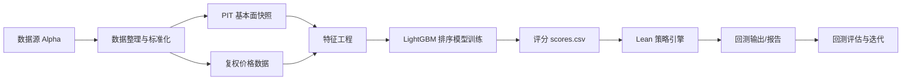
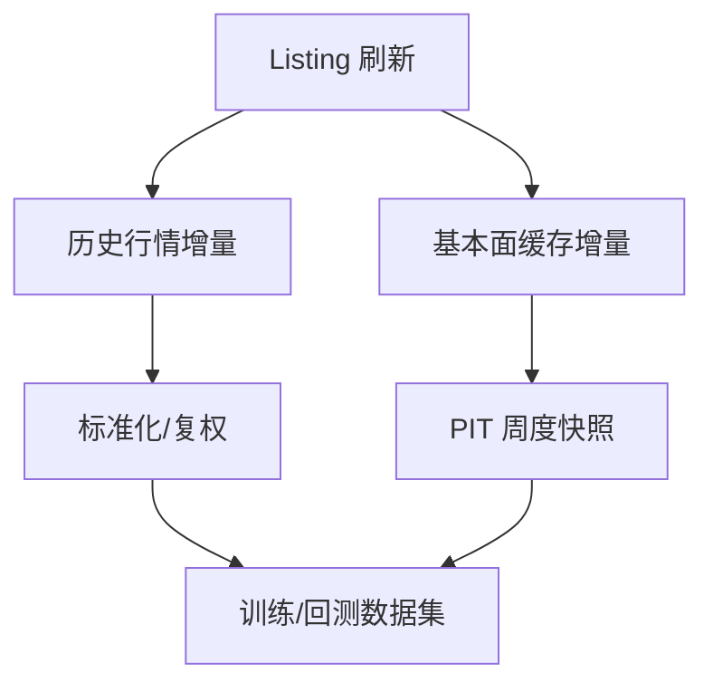
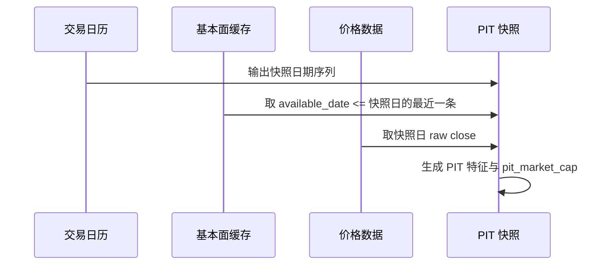
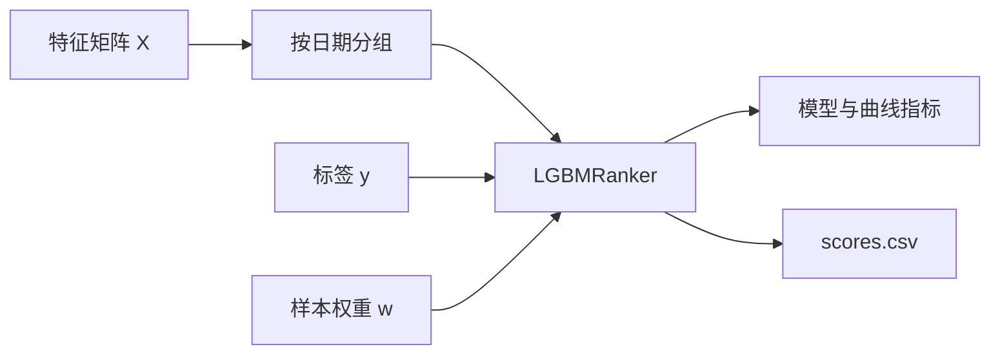
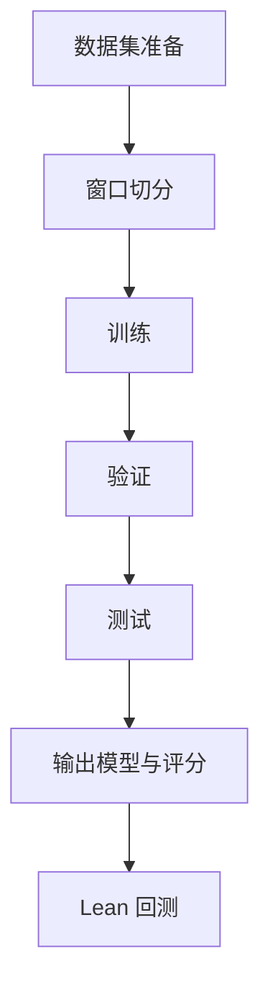
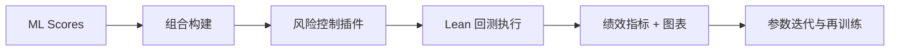

# StockLean 闭环方案总览（Lean × Alpha × PIT × LightGBM）

> 面向投资方的技术与业务闭环说明：从 Lean 选型、数据采集整理、PIT 基本面与快照、LightGBM 训练逻辑，到回测与评估的完整链路。

## 1. 项目定位与闭环目标
- **目标**：构建“数据 → 因子/特征 → 模型训练 → 组合构建 → 回测评估 → 迭代优化”的闭环，确保训练与回测一致、可复现、可审计。
- **策略频率**：周度调仓（周一开盘调仓，快照取上一个交易日收盘）。
- **数据原则**：Alpha-only，避免多源混用带来的分布漂移与一致性问题。

---

## 2. Lean 引擎选型（为什么是 Lean）
**Lean 是 QuantConnect 打磨多年的开源量化引擎，具备可落地的完整闭环能力：**
- **事件驱动回测与实盘一致性**：同一策略脚本可复用到回测与实盘。
- **严格时间序列管理**：支持统一的交易日历、撮合与费用模型。
- **多语言支持**：Python/C# 可混合扩展，适配现有 ML/数据 pipeline。
- **结果可审计**：回测输出包含指标、日志与中间产物，便于复盘与监管式审计。

**本系统将 Lean 作为回测与执行核心，AI 模型只负责“打分/排序/权重倾斜”。**

---

## 3. 数据采集与整理（Alpha-only）
**统一采用 Alpha Vantage 数据源，避免 Stooq/Yahoo 分布差异。**

### 3.1 数据目录结构（核心）
- `data/raw`：原始抓取数据
- `data/normalized`：清洗标准化
- `data/curated`：统一格式数据
- `data/curated_adjusted`：复权数据（训练/回测优先）
- `data/fundamentals/alpha/<SYMBOL>`：基本面缓存
- `data/factors/pit_weekly_fundamentals`：PIT 周度快照

### 3.2 列表与生命周期
- Alpha `LISTING_STATUS` → `data/universe/alpha_symbol_life.csv`
- 保留 listing / delist / rename 映射，确保回测覆盖历史成分（避免幸存者偏差）。

### 3.3 抓取策略要点
- **增量为主，全量为辅**：避免重复拉全量历史，降低成本。
- **限速与重试**：统一遵循 Alpha 速率上限，自动调速与重试，保证稳定抓取。
- **幂等写入**：任何任务可重入、可断点续跑，避免多次写入破坏一致性。

---

## 4. PIT 基本面与周度快照（避免前视偏差）
**PIT（Point-in-Time）原则**：任何时点的特征只能使用当时已公开的数据。\
本系统采用“可用日期 available_date / 披露日期 reportedDate”的组合实现 PIT。

### 4.1 基本面缓存
- 主要接口：`OVERVIEW / INCOME_STATEMENT / BALANCE_SHEET / CASH_FLOW / EARNINGS / SHARES_OUTSTANDING`
- 输出路径：`data/fundamentals/alpha/<SYMBOL>/*.json`

### 4.2 PIT 周度快照
- 以交易日历为基准，将基本面与价格对齐到“快照日”。
- 周度调仓规则：**周一开盘调仓，快照取上一个交易日收盘**。
- `pit_market_cap` 计算：**shares_outstanding × raw close（快照日）**。

---

## 5. LightGBM 排序模型逻辑
**模型定位**：横截面排序模型（Ranker），用于每周选股排名与权重倾斜。

### 5.1 标签与特征
- **标签**：`label_horizon_days`（如 5/20），默认 `open` 价、`label_start_offset=1`（避免前视）。
- **价格特征**：多周期收益、均线偏离、波动率等。
- **PIT 特征**：仅在快照日可用，保证 as-of 对齐。
- **样本权重**：市值与成交额加权（更贴近机构可交易性）。

### 5.2 训练方式
- **模型**：`LGBMRanker`（LambdaMART）
- **分组方式**：按日期分组（每个交易日为一个 group）
- **评估指标**：NDCG@10/50/100、IC/RankIC、训练/验证曲线 gap 评分

---

## 6. 训练流程（Walk-Forward）
- **窗口切分**：训练/验证/测试按月份滚动（如 8 年训练 + 12M 验证 + 12M 测试）。
- **walk-forward 输出**：每个窗口输出评分，保证跨期可比。
- **产物**：
  - `ml/models/lgbm_model.txt`
  - `ml/models/torch_payload.json`（包含窗口与参数）
  - `ml/models/scores.csv`

---

## 7. 回测闭环与策略执行
- **Lean 策略**读取 `scores.csv`，进行**周度选股与权重分配**。
- **风险控制**：最大回撤门控、周度换手上限、仓位上限/下限、防御资产策略。
- **成本模型**：交易费用/滑点/冲击成本可配置。
- **结果输出**：收益、回撤、夏普、周度换手率、持仓明细、回测报告与可视化曲线。

---

## 8. 闭环优势与可扩展性
- **端到端一致性**：训练、回测、实盘均遵循同一数据与日历基准。
- **可解释与可审计**：每次训练/回测可追溯到原始配置与数据。
- **可扩展性**：未来可接入更多数据源或因子（保持 Alpha-only 为主，避免混源误差）。

---

## 9. 投资视角的价值点
- **避免前视偏差**：PIT 基本面 + label 对齐 + as-of 快照。
- **低延迟迭代**：全链路可在单一系统内完成。
- **可控风险**：门控与风险插件的严格约束，确保回测可向实盘过渡。

---

## 10. 后续路线（面向实盘）
- 周度自动化 Checklist（Listing → 基本面 → PIT → 训练 → 回测 → 发单）。
- 更稳定的交易日历基准（交易所日历 + SPY 对齐）。
- 策略层的组合分层与风险预算优化。

---

**结论**：StockLean 已形成完整可落地的量化闭环体系，兼具工程可控性与模型可解释性，可支撑策略从研究走向实盘的工程路径。\
如需现场演示，可通过项目页展示：训练任务、评分输出、回测结果与风险指标。\
